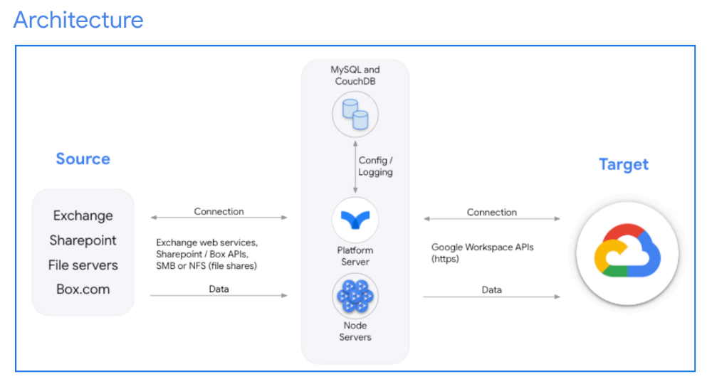

# Migration

## Plan

### Domains

Understand how many domains are in the source environment. Having this information
is important to make changes in the DNS panel during the go-live, as well as when
onboarding the customer.

### Users

Analyzing user data is crucial in planning because it can help you scope the migration
(for example, identifying users who won’t be migrated, or users that require some
coexistence of new and legacy tools).

### Shared mailboxes

Shared mailboxes must be migrated to Google Workspace as generic users or as
groups, so it is important to clarify which option best fits your customer’s needs.

### SharePoint sites and data

SharePoint sites can be migrated to Google Drive as shared drives. However, access
permissioning in Drive works differently than that in SharePoint. For example, it is not
possible to have more restrictive permissions in subfolders. Analyzing the sharing
structure in advance is important.

### Mail data

This information is critical in estimating the overall migration timeline because it lets
you establish the number of items per user or the amount of data per user, as well as
identify how users should be batched for migration.

### Local or regional regulations or restrictions

Different regions might have specific legal or regulatory requirements for handling
personally identifiable information and also could have specific limitations on the
bandwidth or capacity available for data migration.

### Network

Ensure that customers make the necessary changes to their current network for all the
locations to allow users to adopt Google services without interruption.

### Approach to migration

When approaching a migration, follow the Google Workspace deployment methodology
(core-IT, early adopters, go-live) dividing the migration into multiple phases, and leverage delta
migrations before the go-live.

## Do

Use the latest version of the software.
Google regularly updates the Google Workspace Migrate platform and node software
and occasionally updates the database software. You should use the latest version of the software to ensure that you have the most recent Google Workspace Migrate
features and fixes. For details, go to Upgrade the software.

- Estimate the number of nodes needed to complete the migration.
Start with fewer nodes, observe the process, and increase the number of nodes as
needed. This approach helps you to save budget by allowing you to use only as many
virtual machines (VMs) as necessary. Do not exceed 40 nodes per cluster (the
maximum number of supported nodes per cluster). If your workload requires more
nodes, provision additional clusters. For more information about nodes, go to Install the
node servers.
- Invest time in scans to analyze source data.
Scans can be time-consuming, but this upfront investment of time helps to optimize
the migration process and is helpful for reconciliation. In general, scans should be
performed as close as possible to the start of migration rather than weeks or months in
advance. When it’s not possible to perform scans, collect the technical findings from
the source environment using PowerShell, comma-separated values (CSV) file exports
from the interface, or any other method that allows you to collect these values:
- List of accounts and groups
- Other resources that are in scope of migration (for example, calendar
resources)
- Number of items per user per service
These details will help you to distribute loads across different bridges, and calculate the
estimated time needed to complete the migration.
- Separate different services into bridges.
For example, migrate Google Calendar, Google Contacts, and Google Tasks on one
bridge and Exchange or SharePoint data on another bridge. This approach allows you to
troubleshoot each service individually, so if you encounter issues with one service, you
don’t have to stop the overall process.
- Avoid bigger databases if possible.
Bigger databases are slower in general. When the number of records in the project
database is very high (~ 2 billion records) your migration might get stuck. If the project
database size is getting closer to 3 TB , do not continue the migration in that project.
Splitting the data into more projects when a large amount of data is migrated helps to
avoid performance issues.
- Make sure that you discuss the monitoring points with your customer.
The list of the monitoring points depends on the source (for details, go to References).

Actively discuss and agree on the migration scope with customers in advance.
Although customers often want to migrate all data from their source systems, this is not
recommended and could affect migration cost and timings. Similarly, omitting the
migration of data that is time-consuming, such as file revisions, can speed up the
overall process.

- Always follow the recommended system requirements.
For example, when high throughput is a business critical need, consider using IOPs
optimized CPUs and Disks for database VMs.
- Migrate in phases.
Ideally, distribute large data across different phases and use delta migrations before the
go-live.
- Turn off automatic Microsoft Windows Updates & Windows antivirus protection.
Turn off the services on all migration servers. Service updates can potentially reset
servers in the middle of migration, while antivirus services can scan all data and
consume virtual memory.
- Use Google Cloud to install Google Workspace Migrate.
Google has extensively tested Google Workspace Migrate in Google Cloud. Using the
product on Google infrastructure offers advantages such as flexibility and direct
network connections to Google Workspace infrastructure to reduce latency.
- Use Google Chrome browser as your default browser.
- Make sure to reduce network latency.
- Make sure to respect the system requirements.
For details, go to System requirements.
- Create a new project.
If you have run a test migration and now you’re moving to a production migration,
create a new project to migrate the same data to production. Some data might be
skipped by Google Workspace Migrate if you’re using the same data in the same
project as the source.

## Don't

- Don’t migrate the full scope of the data.
Try to limit it by date. If it’s necessary to migrate everything, identify long tail users
(those with significant volumes of data) and run them on a separate bridge. This
method allows you to handle the migration of core data for other users separately,
using delta migrations to bring over older data afterwards.
- Don’t move batched users across clusters.
The migration process stores data in the database and moving users between clusters
can cause data duplication.
- Don’t have one source user mapped to multiple destination users.
Doing so can result in unexpected outcomes (some data might not be migrated,
because it’s already in the database marked as migrated). If you need to do this (for
example, because you need to migrate the shared mailbox content into multiple
accounts), use separate projects and do not run them simultaneously.
- Don’t migrate all types of data on a single bridge.
Single threading on just one bridge means that, if issues occur, you have to stop
everything. It's best practice to use two bridges where one is dedicated for Exchange
data migration and the second is for OneDrive or SharePoint migrations.
- Don't drop off any node server even though its status is not busy.
Dropping off might cause some issues when you are in the middle of migration. In some
scenarios the status might change in the middle of migration. When the bridge is not
running, it’s fine to turn off the nodes to save on costs.

### Architecture

TOO COMPLICATED

## Aide Google workspace admin help

<https://support.google.com/a/answer/3035792?sjid=12614352032187282341-EU>

## Todo

tuto pour les collègues :

- enregistrement du nom d'utilisateur
- on montre jusqu'au bout le drive
- on monte le drive
- questions associées au Calendar : utilisations sur les applis de téléphone
- télécharger Drive pour ordinateur et le synchroniser

vérifier que la migration nouveau s'est correctement déroulée
